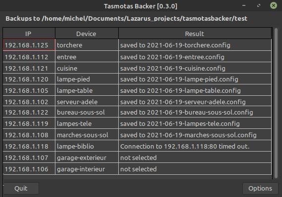

# tasmotasbacker : Tamotas Backer

**Version 0.3.5** (July 5, 2021)

A utility that can back up the configuration of all Tasmota devices that share a common MQTT topic. It uses the [Eclipse mosquitto](https://mosquitto.org/) library to communicate with the MQTT broker to obtain a list of IP addresses of Tasmota devices connected to the broker.

<!-- The screen capture shows the message sent to the public `test.moquitto.org` broker and it's reply. In this example, the client is subscribed to the same topic used to send the message, which in many cases would not be done. -->

<!-- TOC -->

- [1. Requirements](#1-requirements)
    - [1.1. Linux](#11-linux)
    - [1.2. Windows 10](#12-windows-10)
- [2. Compiling](#2-compiling)
- [3. Testing](#3-testing)
- [4. Installation and Releases](#4-installation-and-releases)
- [5. Program Options](#5-program-options)
- [6. Usage](#6-usage)
- [7. WARNINGS](#7-warnings)
    - [7.1. Beta Version](#71-beta-version)
    - [7.2. Security](#72-security)
- [8. Acknowledgment](#8-acknowledgment)
- [9. Licence](#9-licence)

<!-- /TOC -->

## 1. Requirements

Two Free Pascal units are required

- `mosquitto.pas` - conversion of the C `mosquitto.h` header to Pascal, provides the same API as the C version
- `mqttclass.pas` - Object Pascal wrapper class to ease the integration of libmosquitto into Object Oriented 

These files, found in the [mosquitto-p](mosquitto-p/) directory, are copied from the [GitHub repository](https://github.com/chainq/mosquitto-p) with the same name by Károly Balogh (chainq).

In addition the  [Eclipse mosquitto](https://mosquitto.org/) library must be installed on the system.

### 1.1. Linux

The libmosquito library is needed. In Debian systems this means installing two packages:
-  `libmosquitto1`
-  `libmosquitto-dev`

The first, `libmosquitto1` will probably already be installed if the mosquitto-clients package is available on the system. In Debian-based systems these packages can be installed with a package manager such as [Synaptic](http://www.nongnu.org/synaptic/) or from the command line.

    $ sudo apt install libmosquitto1 libmosquitto-dev

There is no requirement to install the mosquitto MQTT broker.

### 1.2. Windows 10

1. Get the latest binary package from [Eclipse mosquitto Download](https://mosquitto.org/download/). Version 2.0.10 is available as of May 5, 2021. Chose the appropriate 64-bit installer (`mosquitto-2.0.10-install-windows-x64.exe`) or 32-bit installer (`mosquitto-2.0.10-install-windows-x32.exe`). 

2. Click on the downloaded application to install the package. It is not necessary to install it as a service if an MQTT broker is not needed. 

> - The 64-bit package was installed in `C:\Program Files\mosquitto\`. 
> - The 32-bit package will probably go into `C:\Program Files (x86)\mosquitto\`.
 
 3. Test the `mosquitto_sub` and `mosquitto_pub` utilities from the command line using the host name or IP address of a reachable MQTT broker instead of &lt;<i>mqtt_broker</i>&gt;. 

<pre>
   C:\Users\michel>"c:\Program Files\mosquitto\mosquitto_sub" -h &lt;<i>mqtt_broker</i>&gt; -t "#"
</pre>

4. Copy the mosquitto libraries <pre>
        C:\Program Files\mosquitto\mosquitto.dll
        C:\Program Files\mosquitto\mosquitto_dynamic_security.dll
        C:\Program Files\mosquitto\libcrypto-1_1-x64.dll
        C:\Program Files\mosquitto\libssl-1_1-x64.dll
        C:\Program Files\mosquitto\mosquittopp.dll
</pre> to the same folder containing the compiled `lazmqttc.exe` executable. Depending on use, they may not all be necessary, but the first two are needed without doubt. 

>> It is left as an exercise for knowledgable Windows users to find a more elegant way of ensuring that the DLLs are found.

Ultimately, if a mosquitto MQTT broker is to be run on the system, it may make more sense to simply copy the executable into the `mosquitto` directory along side the `mosquitto_pub.exe` and `mosquitto_sub.exe` utilities it emulates.

## 2. Compiling

The repository is self-contained (except for the mosquitto library of course), so creating this tool should be straightforward. Clone the repository, start the Lazarus IDE, load the project, and compile. 

When compiling a final version, it would be advisable to heed the following advice.

1.  Modify the default password encryption key `DEFAULT_KEY` in the `units/pwd.pas` file. That way it will not be easy for any one of the numerous users of this application to gain access to a system to read the configuration file and then obtain the MQTT broker password. See [7.2. Security](#72-security) for more details.

2.  Add an application icon. Select `Load Icon` in `Project / Project Options` in the Lazarus IDE. The `tasmotabacker.png` image in the `images` directory can be used .

3.  Compile the release version. Select the `Release` build mode in `Project / Project Options / Compiler Options` in the Lazarus IDE. This will reduce the size of the executable by an order of magnitude.

## 3. Testing

The project was built with Lazarus 2.0.12 (Free Pascall 3.2.0) on a Mint 20.1 system with version 1.6.9-1 of the mosquitto libraries. A cursory test was done with the same compiler in Windows 10.

There is a [proof of concept project](poc) in the repository that verifies that a Tasmota configuration can be downloaded.

## 4. Installation and Releases

The current release contains a compressed Linux binary, `tasmotasbacker.gz` that runs on Mint 20.1. Extract the binary `tasmotasbacker` to a directory in the search path such as `~./local/bin/tasmotasbacker/`.  Copy the image `iamges/tasmotabacker.png` into the same directory. The `installation` directory contains a `tamostasbacker.desktop` file along with rudimentary instructions on how to install the utility in a Mint 20.1 Mate system. Presumably, installation in other Linux distributions would be more or less the same.

Details about installation of an application in Windows are unfortunately not provided. A binary is provided in the `tasmotasbacker.zip` archive.

## 5. Program Options

In Linux, the program parameters are saved in the `ini` configuration file named  `~/.config/sigmdel/tasmotabacker/options.ini` where `~` is the user home directory. So the fully expanded file name is
<pre> /home/&lt;<i>user</i>&gt;/.config/sigmdel/tasmotasbacker/options.ini</pre>

In Windows 10, the file is saved in the local `AppData` folder :
<pre>  C:\Users\&lt;<i>user</i>&gt;\AppData\Local\sigmdel\tasmotasbacker\options.ini</pre>

## 6. Usage

Information on how to use the program can be found on this site: [DIY Tasmota Backups](https://sigmdel.ca/michel/ha/tasmota/tasmota_backups_en.html).

## 7. WARNINGS

### 7.1. Beta Version

This is a beta version. While it does work, there are rough edges.

Because there can be timeouts when obtaining the configuration of multiple Tasmota devices, two options have been added: a timeout option and a retry option. The default timeout, 4 seconds (4000 ms), usually works very well on a system with a 4th generation i7 CPU running Linux Mint 20.1. However the timeout had to be increased to 5 or even 6 seconds (5000-6000 ms) on a system with a 4th generation i5 running Windows 11 connected to the same local area network.

If you compile the program, then there are a couple of directives in the `main.pas` unit (named `DEBUG_HTTP_REQUEST` and `DEBUG_BACKUP`) that will log some timing information if defined. This can be useful when trying to set default timeout and retries values. If using a binary release, then adjust the `Connect attempts` and `Connect timeout` fields in the `Backup parameters` sheet. 

### 7.2. Security

Prior to version 0.3.3, the MQTT broker password was stored in plain text in the configuration file. Do not save the MQTT broker password in the `Options` screen in these older versions.

A quick fix was added in version 0.3.3 to encrypt the password. A default encryption key is defined in `units\pwd.pas` which should be changed if compiling the program (see 2. Compiling for details). However those using a binary release can override the default key by storing a different key in a file named `key.txt` in the directory that contains the configuration file. The file should contain the key on one line and nothing else. Since this is a plain text file, this is not to be considered secured at all.

Note that the MQTT user and password are transmitted in plain text over an HTTP connection, so truly secure handling of the MQTT password will have to wait until communication with the broker using the HTTPS protocol is implemented.

## 8. Acknowledgment

Obviously, this utility would not have been possible without 

- the [Free Pascal](https://www.freepascal.org/) and the [Lazarus Ide](https://www.lazarus-ide.org/) projects
- the [Eclipse Mosquitto](https://github.com/eclipse/mosquitto) project and 
- the [mosquitto-p](https://github.com/chainq/mosquitto-p) project by Károly Balogh (chainq).

Useful information was obtained from others. Where possible, acknowledgment and references are provided in the source code.

## 9. Licence

The [Eclipse Mosquitto](https://github.com/eclipse/mosquitto) project is dual-licensed under the Eclipse Public License 2.0 and the
Eclipse Distribution License 1.0.

The content of the `mosquito-p` repository is covered by the ISC License ([SPDX](https://spdx.dev/): [ISC](https://spdx.org/licenses/ISC.html)).

The **BSD Zero Clause** ([SPDX](https://spdx.dev/): [0BSD](https://spdx.org/licenses/0BSD.html)) licence applies to the original code in this repository.
