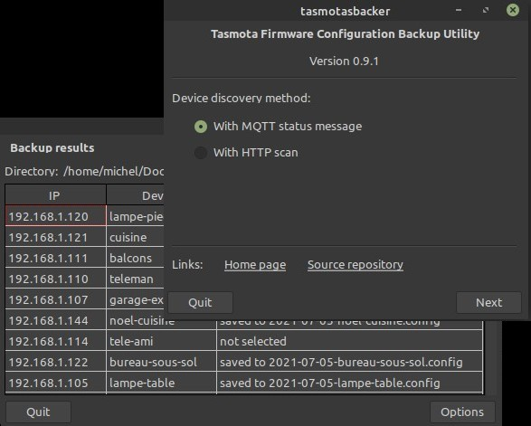

# tasmotasbacker : Tasmotas Backer

**Version 0.9.1** (July 14, 2021)

A utility to back up the configuration of all Tasmota devices on a local network. Discovery of Tasmota devices can be done by querying them through an MQTT broker or by performing an HTTP scan of IP addresses on the LAN. 

The [Eclipse mosquitto](https://mosquitto.org/) library is used to exchange messages with the MQTT broker. Should the library not be installed then the utility will run.

<!-- TOC -->

- [1. Requirements](#1-requirements)
    - [1.1. Linux](#11-linux)
    - [1.2. Windows 10](#12-windows-10)
- [2. Compiling](#2-compiling)
- [3. Testing](#3-testing)
- [4. Program Options](#4-program-options)
- [5. Usage](#5-usage)
- [6. WARNINGS](#6-warnings)
    - [6.1. Timing](#61-timing)
    - [6.2. Security](#62-security)
- [7. Similar Projects](#7-similar-projects)
- [8. Acknowledgment](#8-acknowledgment)
- [9. Licence](#9-licence)

<!-- /TOC -->

## 1. Requirements

Two Free Pascal units are required

- `mosquitto.pas` - conversion of the C `mosquitto.h` header to Pascal, provides the same API as the C version
- `mqttclass.pas` - Object Pascal wrapper class to ease the integration of libmosquitto into Object Oriented 

These files, found in the [mosquitto-p](mosquitto-p/) directory, are copied from the [GitHub repository](https://github.com/chainq/mosquitto-p) with the same name by Károly Balogh (chainq).

In order to discover Tasmota devices by MQTT message to the Tasmota group topic or topics, the  [Eclipse mosquitto](https://mosquitto.org/) library must be installed on the system. The program will work if the library is not installed, but of course, an HTTP scan will have to be used to identify Tasmota devices on the network. 

### Brief instructions on installing the optional `mosquitto` library

#### Linux (Debian systems)

In Debian-based systems, the libmosquitto  packages can be installed with a package manager such as [Synaptic](http://www.nongnu.org/synaptic/) or from the command line.

    $ sudo apt install libmosquitto1 libmosquitto-dev

Note that the first package, `libmosquitto1`, will probably already be installed if the mosquitto-clients package is available on the system. There is no requirement to install the mosquitto MQTT broker.

#### Windows 10

1. Get the latest binary package from [Eclipse mosquitto Download](https://mosquitto.org/download/). Version 2.0.10 is available as of May 5, 2021. Chose the appropriate 64-bit installer (`mosquitto-2.0.10-install-windows-x64.exe`) or 32-bit installer (`mosquitto-2.0.10-install-windows-x32.exe`). 

2. Click on the downloaded application to install the package. It is not necessary to install it as a service if an MQTT broker is not needed. 

> - The 64-bit package was installed in `C:\Program Files\mosquitto\`. 
> - The 32-bit package will probably go into `C:\Program Files (x86)\mosquitto\`.
 
 3. Test the `mosquitto_sub` and `mosquitto_pub` utilities from the command line using the host name or IP address of a reachable MQTT broker instead of &lt;<i>mqtt_broker</i>&gt;. 

<pre>
   C:\Users\michel>"c:\Program Files\mosquitto\mosquitto_sub" -h &lt;<i>mqtt_broker</i>&gt; -t "#"
</pre>

4. Copy the mosquitto libraries <pre>
        C:\Program Files\mosquitto\mosquitto.dll
        C:\Program Files\mosquitto\mosquitto_dynamic_security.dll
        C:\Program Files\mosquitto\libcrypto-1_1-x64.dll
        C:\Program Files\mosquitto\libssl-1_1-x64.dll
        C:\Program Files\mosquitto\mosquittopp.dll
</pre> to the same folder containing the compiled `lazmqttc.exe` executable. Depending on use, they may not all be necessary, but the first two are needed without doubt. 

>> It is left as an exercise for knowledgable Windows users to find a more elegant way of ensuring that the DLLs are found.

Ultimately, if a mosquitto MQTT broker is to be run on the system, it may make more sense to simply copy the executable into the `mosquitto` directory along side the `mosquitto_pub.exe` and `mosquitto_sub.exe` utilities it emulates.

## 2. Compiling

The repository is self-contained (except for the mosquitto library of course), so creating this tool should be straightforward. Clone the repository, start the Lazarus IDE, load the project, and compile. 

When compiling a final version, it would be advisable to heed the following advice.

1. Ensure that the directives 
 - `UseCThreads`, 
 - `INCLUDE_MQTT_OPTIONS`, 
 - `INCLUDE_HTTP_OPTIONS`,
 - `DYNAMIC_MOSQLIB`,  
 are added in the `Personalised Options` in `Project Options /Compiler Options`. Optionally, the last directive may be omited. In that case, the `mosquitto` library will be linked in at compile time. Consequently, the library must be present when the program is compiled. Futhermore, the utility will abort immediately if the library is not present on the system. (Programmer's Guide: Using a library in a pascal program). Because the extra time to load the library at run-time is negligeable and it avoids theses problems, it is best to define the directive.

2.  Modify the default password encryption key `DEFAULT_KEY` in the `units/pwd.pas` file. That way it will not be easy for any one of the numerous users of this application to gain access to a system to read the configuration file and then obtain the MQTT broker password. See [7.2. Security](#72-security) for more details.

2.  The application icon should be defined, but if it is not then select `Load Icon` in `Project / Project / Project Options` in the Lazarus IDE. The `tasmotabacker.png` image in the `images` directory can be used.

3.  Compile the release version. Select the `Release` build mode in `Project / Project Options / Compiler Options` in the Lazarus IDE. This will reduce the size of the executable by an order of magnitude.

## 3. Testing

The project was built with Lazarus 2.0.12 (Free Pascall 3.2.0) on a Mint 20.1 system with version 1.6.9-1 of the mosquitto libraries. A cursory test was done with the same compiler in Windows 10.

There is a [proof of concept project](poc) in the repository that verifies that a Tasmota configuration can be downloaded.

<!--
 xx 4. Installation and Releases

The file `tasmotasbacker-r****.gz`, contains a compressed `x86_64-linux` binary which was tested on Mint 20.1 . Extract the binary `tasmotasbacker` to a directory in the search path such as `~./local/bin/`.  Copy the image `images/tasmotabacker.png` into the same directory. The `installation` directory contains a `tamostasbacker.desktop` file along with rudimentary instructions on how to install the utility in a Mint 20.1 Mate system. Presumably, installation in other Linux distributions would be more or less the same.

Details about installation of an application in Windows are unfortunately not provided. A `x86_64-win64` binary is provided in the `tasmotasbacker0-r****.zip` archive.
-->

## 4. Program Options

In Linux, the program parameters are saved in the `ini` configuration file named  `~/.config/sigmdel/tasmotabacker/options.ini` where `~` is the user home directory. So the fully expanded file name is
<pre> /home/&lt;<i>user</i>&gt;/.config/sigmdel/tasmotasbacker/options.ini</pre>

In Windows 10, the file is saved in the local `AppData` folder :
<pre>  C:\Users\&lt;<i>user</i>&gt;\AppData\Local\sigmdel\tasmotasbacker\options.ini</pre>

Starting with version 0.3.6, all timeouts are measured in seconds; they were measured in milliseconds in previous versions. In the same version, two parameters, `ConnectAttempts` and `ConnectTimeout`, have been renamed `DownloadAttempts` and `DownloadTimeout` respectively. 

If updating from a previous version, it may be simpler to delete the `ini` configuration file to avoid leaving orphaned entries in the file.

## 5. Usage

Information on how to use the program can be found on this site: [DIY Tasmota Backups](https://sigmdel.ca/michel/ha/tasmota/tasmota_backups_en.html).

## 6. WARNINGS

### 6.1. Timing

<!--
If an incorrect IP address is given for the MQTT broker, the program appears to hang when an MQTT message is sent to find the Tasmota devices. To avoid this problem an attempt to establish a TCP connection with given host and port is made. The MQTT broker will be used only if that connection can be made. The initial page of utility has a `Timeout` field which specifies the maximum time to wait for a reply during that intitial TCP connection. The timeout is specified in seconds, its minimum value is 1 second.
-->

Because the HTTP requests sent by the utility are blocking, timeouts have to be specified otherwise the program could hang. There are two options pertaining to downloads of the Tasmota device configurations that can be tweaked:

3. `Download attempts` - the maximum number of times an HTTP request for the Tasmota configuration is made.

4. `Download timeout` -  the maximum time to wait for a reply. Specified in seconds, the minimum is 1 second.

There are two similar options that apply when sending HTTP requests to scan the network for Tasmota devices.

1.  `Connect attempts` - the maximum number of times an HTTP request for the hostname is sent to an IP address to establish if it is a Tasmota device.

2.  `Connect timeout` - the maximum time to wait for a reply. Specified in seconds, the minimum is 1 second.

Finally, there's a `Timeout` optionsin the MQTT broker. This is the maximum time, in seconds, allowed for establishing a TCP connection with the MQTT broker.

Consult [DIY Tasmota Backups](https://sigmdel.ca/michel/ha/tasmota/tasmota_backups_en.html) for more information on this topic.

### 6.2. Security

Prior to version 0.3.3, the MQTT broker password was stored in plain text in the configuration file. Do not save the MQTT broker password in the `Options` screen in these older versions.

A quick fix was added in version 0.3.3 to encrypt the password. A default encryption key is defined in `units\pwd.pas` which should be changed if compiling the program (see 2. Compiling for details). However those using a binary release can override the default key by storing a different key in a file named `key.txt` in the directory that contains the configuration file. The file should contain the key on one line and nothing else. Since this is a plain text file, this is not to be considered secured at all.

Note that the MQTT user and password are transmitted in plain text over an HTTP connection, so truly secure handling of the MQTT password will have to wait until communication with the broker using the HTTPS protocol is implemented.

## 7. Similar Projects

A version of this project that does not use an MQTT broker to find Tasmota devices is available.

- [tasmotasbacker0](https://github.com/sigmdel/tasmotasbacker0).

It does not require the `mosquitto` library and only uses HTTP requests to find Tasmota devices and download their configuration. There is also an older version of the project 

- [tasmotasbacker-mqtt-only](https://github.com/sigmdel/tasmotasbacker/tree/mqtt-only)

that only usess MQTT messages to discover devices and therefore requirs the `mosquitto` library.

There are two Python scripts on GitHub that do essentially the same thing:

- [tas-backup](https://github.com/dragonflyuk) by dragonflyuk,
- [Tasmota-Config-Backup](https://github.com/rt400/Tasmota-Config-Backup/blob/master/tasmota_backup.py) by Yuval (rt400).

There is also a much more ambitious PHP/Sqlite project:

- [TasmoBackupV1](https://github.com/danmed/TasmoBackupV1) by danmed.

A thorough search would probably turn up many more references.

## 8. Acknowledgment

Obviously, this utility would not have been possible without 

- the [Free Pascal](https://www.freepascal.org/) and the [Lazarus Ide](https://www.lazarus-ide.org/) projects
- the [Eclipse Mosquitto](https://github.com/eclipse/mosquitto) project and 
- the [mosquitto-p](https://github.com/chainq/mosquitto-p) project by Károly Balogh (chainq).

Useful information was obtained from others. Where possible, acknowledgment and references are provided in the source code.

## 9. Licence

The [Eclipse Mosquitto](https://github.com/eclipse/mosquitto) project is dual-licensed under the Eclipse Public License 2.0 and the
Eclipse Distribution License 1.0.

The content of the `mosquito-p` repository is covered by the ISC License ([SPDX](https://spdx.dev/): [ISC](https://spdx.org/licenses/ISC.html)).

The **BSD Zero Clause** ([SPDX](https://spdx.dev/): [0BSD](https://spdx.org/licenses/0BSD.html)) licence applies to the original code in this repository.
