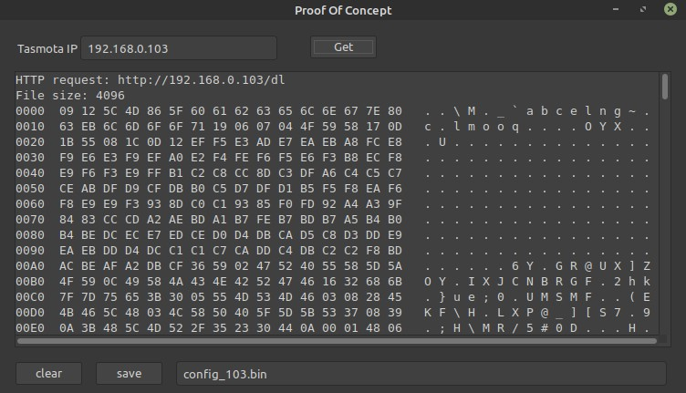

# Proof of concept

This is a simple application that test a basic approach to getting the configuration from a Tasmota device and saving it to a binary file and then comparing it to the downloaded configuration file obtained using Tasmota itself.

## Downloading the Tasmota Configuration 

1. Enter the IP address of the Tasmota device at the top
2. Click on the Get button
    - the memo will be filled with a hexadecimal dump of the configuration
3. Enter the name of the binary file in the bottom edit box
4. Click on the save button

## Verifying the Downloaded Configuration

5. Open the Tasmota web server at the same IP address
6. Click on [Configuration] button
7. Click on the [Backup Configuration] button
8. Save the device configuration in the same directory as the binary file saved in step 4

9. Compare the two binary files<pre>
michel@hp:~$ <b>cmp config_103.bin Config_lampe_9.1.0.dmp</b>
michel@hp:~$ 
</pre>

    - if the files are the same then `cmp` will be silent as shown above, otherwise it will indicate where the first difference is found
